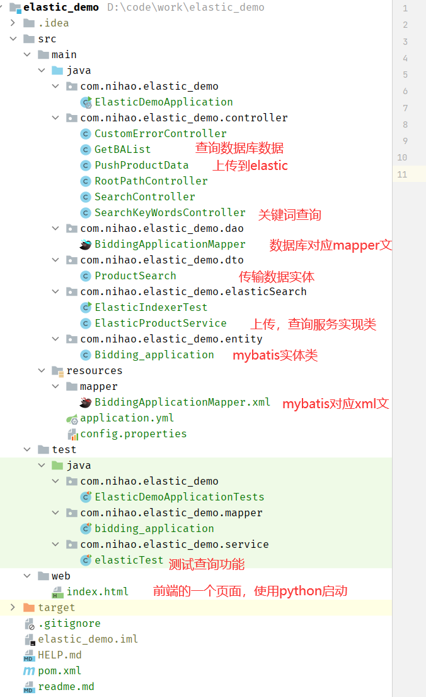

# elastic search 的基本使用流程测试
实现功能
- 从数据库中查询、
- 上传到elastic search
- 页面上请求搜索（关键字

效果展示

## 基本环境
- 安装好centos
- docker
- elastic 并启动一个实列
## 项目结构

## 学习流程
修改
- 注意：我没有将端口等抽离到一个配置文件中
- 首先你需要去修改数据库配置
- 修改entity的数据，你的很可能和我不同
- 另外，你需要去修改你的elastic服务器地址和端口号等

运行
- springboot项目，直接运行即可
- 前端页面，使用python功能，切换到src/web/index.html文件夹下
- 运行命令 python -m http.server

